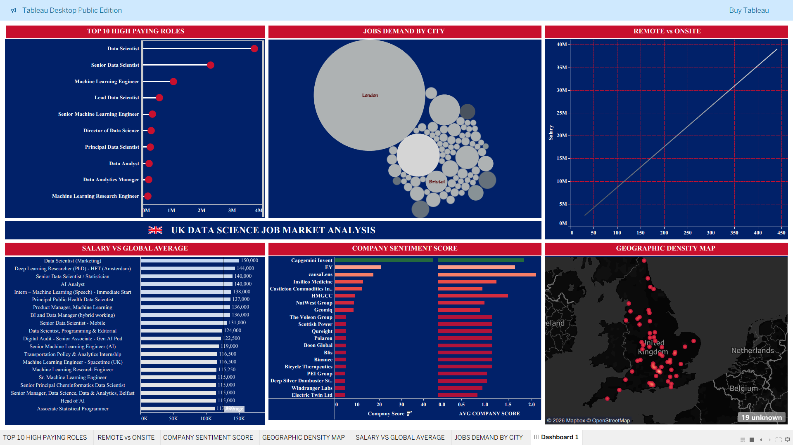

📊 UK Data Science Job Market Analysis | Tableau Dashboard

I’m excited to share my latest Tableau project analyzing the UK Data Science job market 🇬🇧

🔍 Key insights include:
• Top high-paying data science & ML roles
• Job demand by UK cities (London leads 📍)
• Remote vs onsite work trends
• Salary comparison with global averages
• Company sentiment analysis
• Geographic job density mapping

🛠 Tools Used:
• Tableau Desktop Public
• Data Analysis & Visualization

## Dashboard Preview

🔗 Tableau Dashboard:
(https://public.tableau.com/app/profile/abrar.ahamed7210/viz/1UKJOBmarketEXPORTEDPACKAGEfinal/Dashboard1?publish=yes)

I’m actively learning and building real-world analytics projects.  
Feedback and suggestions are welcome!

#DataAnalytics #DataScience #Tableau #UKJobs #AnalyticsPortfolio

